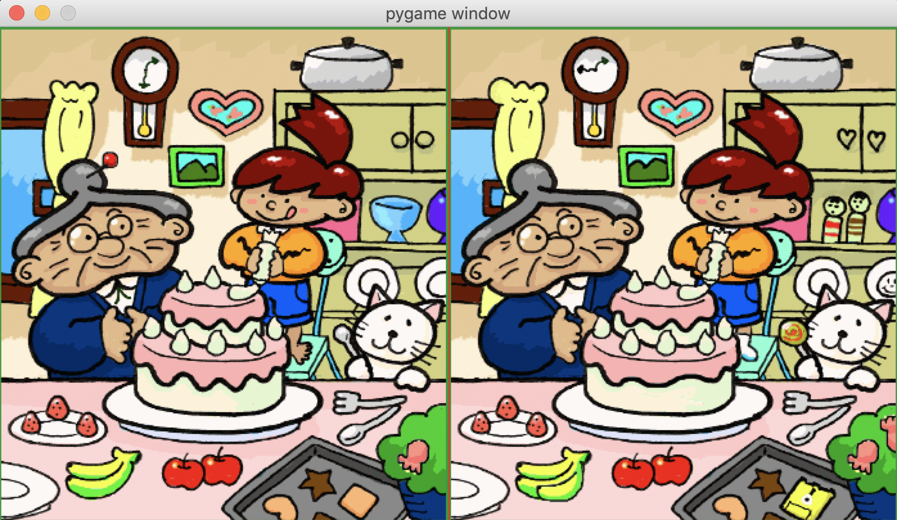
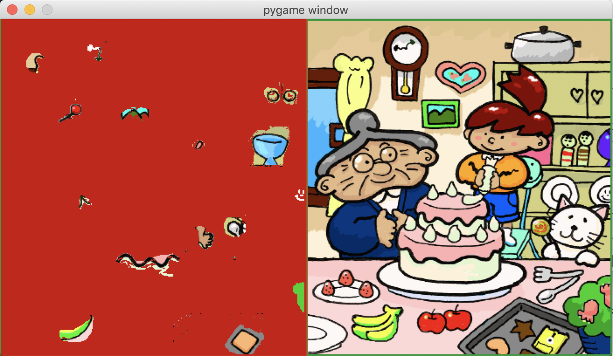

# Find the Difference Solver
#### Created by Adiel Felsen

## Description
This pygame application compares two side by side images and highlights the differences between them. This is intended to be used as a solver for "spot the difference" games. Using pygame's image array functionality, it compares each pixel on the left side of an image to each pixel on the right side of an image, filling in similarities in red.

## Instructions for use:
* Spacebar: Switches between the original image and the new image with all similarities covered in red.
* Right arrow key: Increases the color "leeway" - allows similar (but not exact) colors to be considered the same. (This is necessary because of image compression. Not every pixel on the left side is exactly the same as the corresponding pixel on the right).
* Left arrow key: Decreases the color "leeway"
* Mouse click: Switches to the next image

## Image format requirements:
1. There must be one image on the left side and one image on the right side. (Any vertical shift will not work).
  * It is okay if the images are separated (for example a line runs down the middle or there is whitespace in between).
  * However, there *cannot* be space between the left image and the left side of the screen.
2. The image must be named "Spot" + imagenumber + ".png" and put in the assets folder.
  * For example, the first image would be named "Spot1.png", the second "Spot2.png", etc.

## Example

